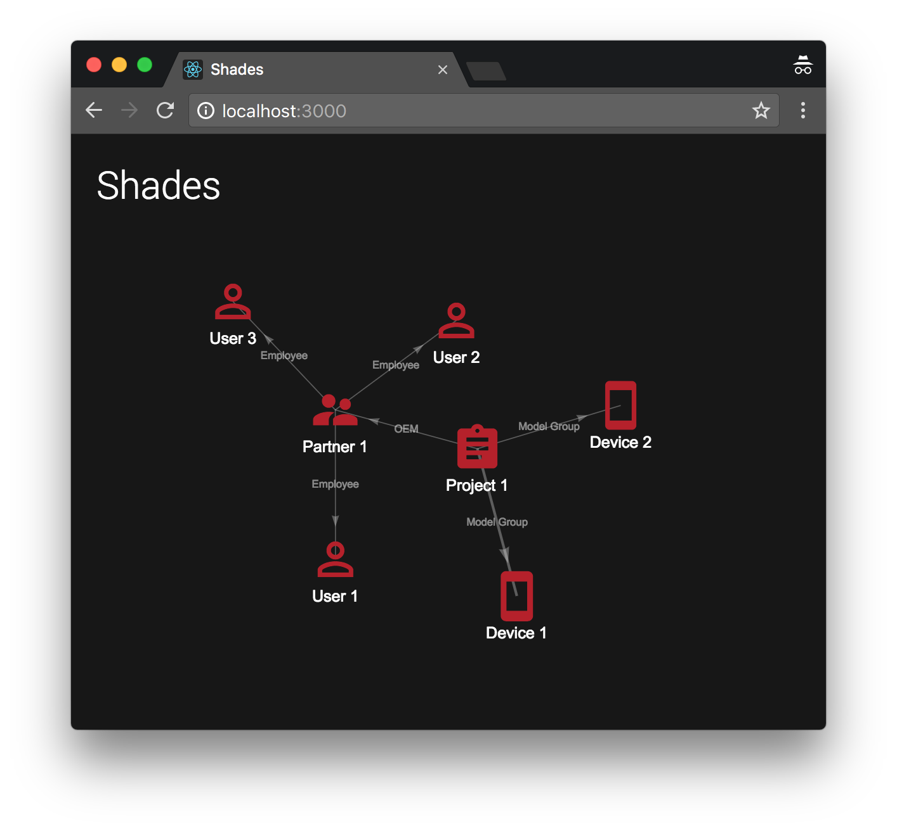

## Shades

Welcome to Shades, an entity relationship service.

Modern web applications are composed of micro-services with different data sources. One problem with this architecture is mapping the relationships between the various entities that are modeled in those data sources. For relationships that span multiple levels, or for bi-directional traversal, this problem becomes even more difficult.

Common solutions, such as Spark, are big data tools that are language specific or rely only on a tabular view.
 
Our proposed solution: Entity Relationship Manager

A distributed, modular middleware service that can pull data from a variety of sources, transform it into any kind of projection, and handle queries on those projections. This single service can be used to generate hierarchical relationships (trees), graphs, table views, and so on.

### Repositories

* [shades](https://github.com/shades-io/shades) - Framework for entity relationship management using CQRS/Event Sourcing
* [shades-ui](https://github.com/shades-io/shades-ui) - UI for Shades
* [shades-broker-mock](https://github.com/shades-io/shades-broker-mock) - Mock Shades broker
* [shades-projection-mock](https://github.com/shades-io/shades-projection-mock)
* [shades-worker](https://github.com/shades-io/shades-worker) - Worker for Shades
* [shades-store-redis](https://github.com/shades-io/shades-store-redis)
* [shades-module-loader](https://github.com/shades-io/shades-module-loader) - Loads configured modules
